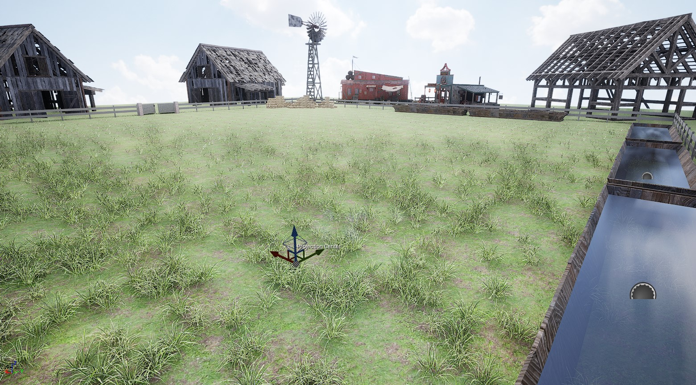
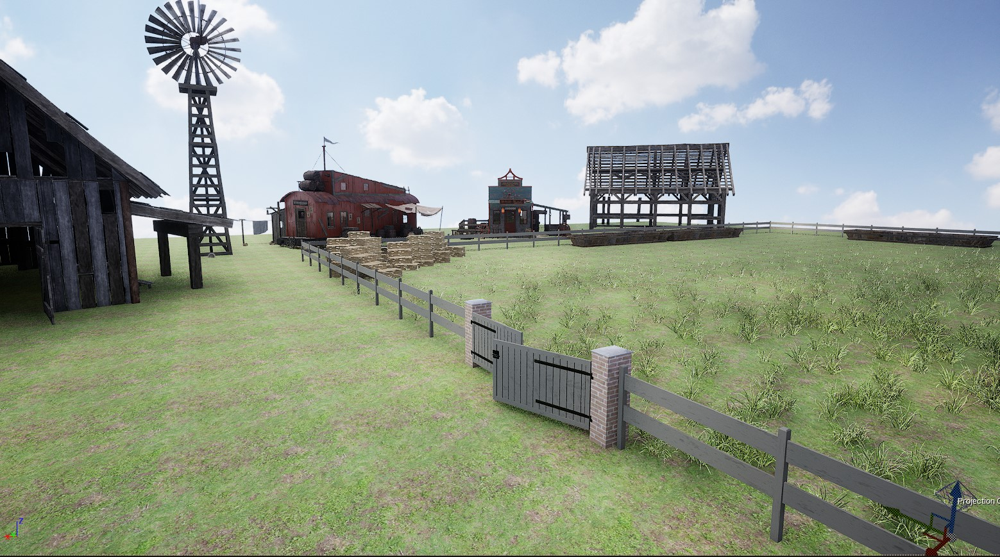
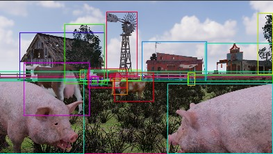
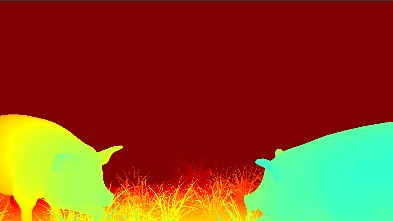
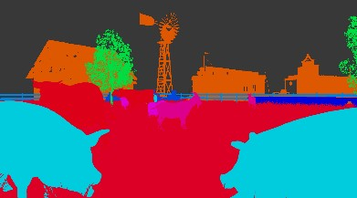
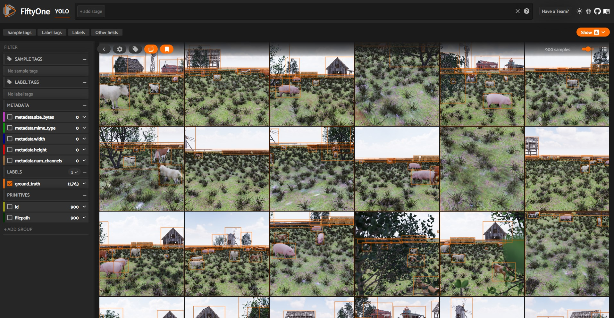
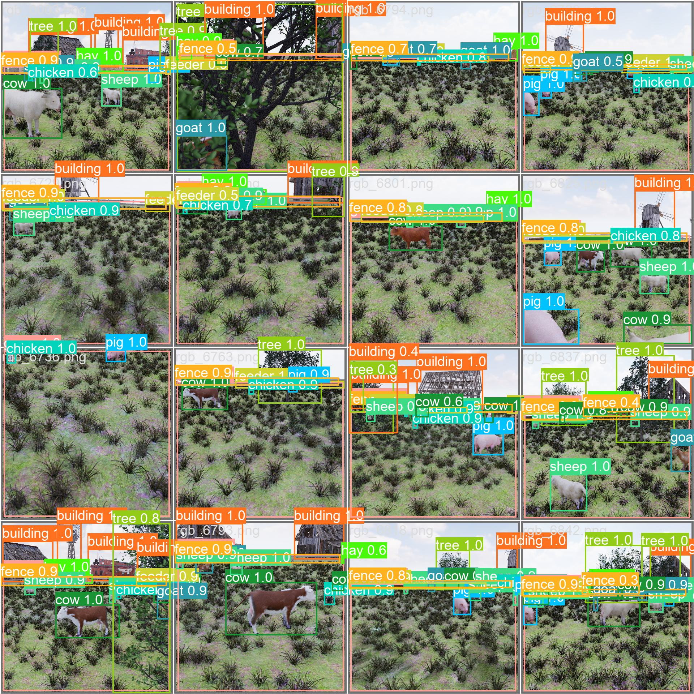

# Synthesize Training Data for Livestock Identification via Omniverse Replicator
This is a project to synthesize training data for livestock identification via Omniverse Replicator.

## How to use

First, you need to import the USD files from [google drive](https://drive.google.com/drive/folders/1TqAiXHGsPc-WnUMMXVCzaXpLk0p_mfiZ?usp=share_link) to your omniverse server. To be consistent with the ReplicatorScript.py, you should import them under `omniverse://localhost/Users/admin/` path.

Second, you need to run the python script ReplicatorScript.py in Omniverse Replicator and you will get your synthetic training data in `E:/Replicator/datasets/ReplicatorData`. If you want to change the output path, you need to change the line 123 in ReplicatorScript.py to the path you want.

To be consistent with the following python scripts for converting training data format, your file directory structure should be like this.

```
--project_folder

	--ConvertToCOCO.py

	--ConvertToYOLO.py

	--Voxel51Visualization.py

	--datasets

		--ReplicatorData

			--training data that synthesized by omniverse replicator
```

Third, you need to run the python script ConvertToCOCO.py in project_folder to convert the training data from Replicator format to COCO format. The COCO format data will be generated in `project_folder/datasets/COCOData/`.

Forth, you could run the python script ConvertToYOLO.py in project_folder to convert the training data from COCO format to YOLO format. The YOLO format data will be generated in `project_folder/datasets/YOLOData/`.

Fifth, you could run the python script Voxel51Visualization.py to visualize the training data.

To test the synthetic training data, you could use the YOLOv5 neural network with the omniverse.yaml file. The specific instruction for YOLOv5 could be found in its GitHub project.

## Some Result

### Built Scene in Unreal





### Training data Visualization

#### Bounding Box



#### Depth Graph



#### Semantic Segmentation



#### Visualization in Voxel51



### Result in YOLOv5

Based on the training data synthesized by the system, this project trained a YOLOv5 neural network to detect bbox. The dataset contains 8100 train images, 900 validation images, and 1000 test images. The neural network is trained for 200 epochs and the training takes about 14 hours. The pretrained model used in this task is YOLOv5m. The mAP_0.5 is 0.9722 and the mAP_0.5_95 is 0.8942.


